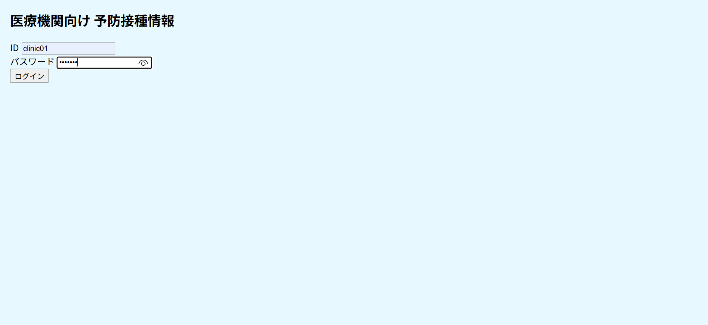
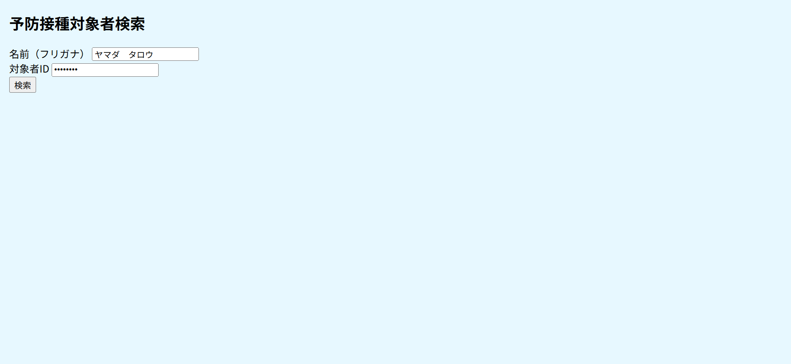
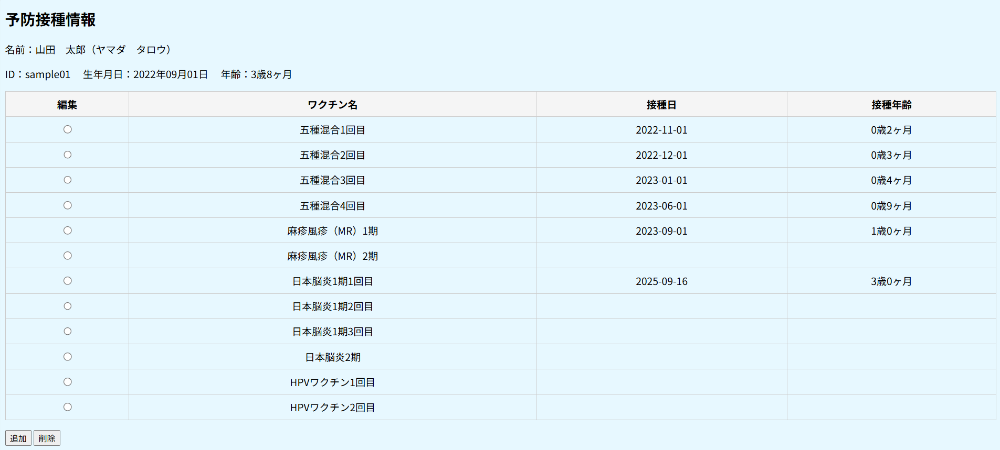
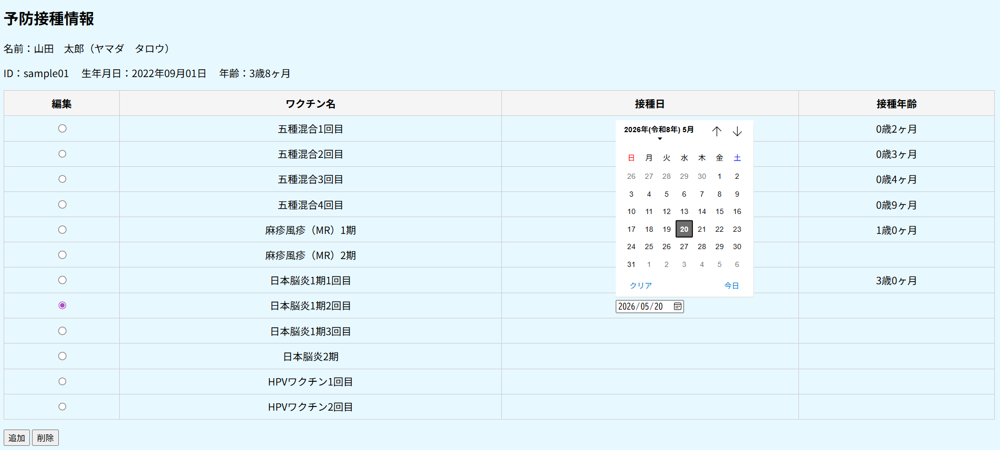
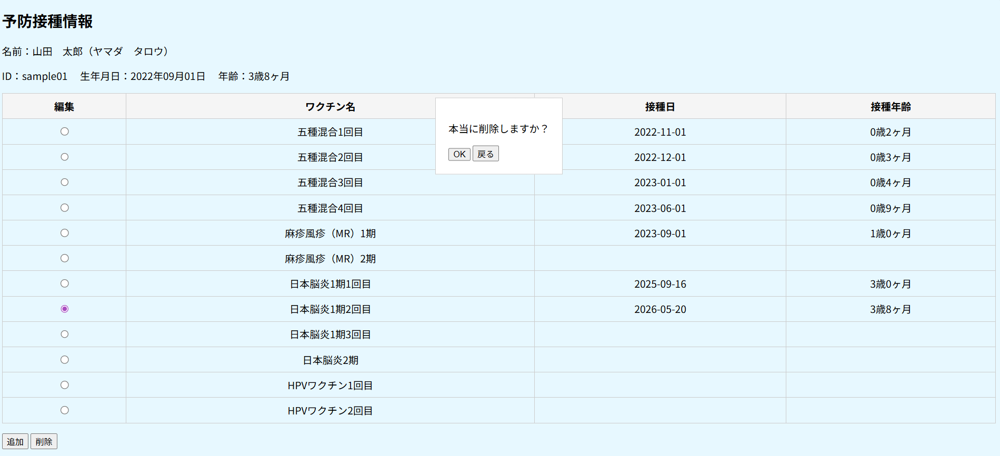
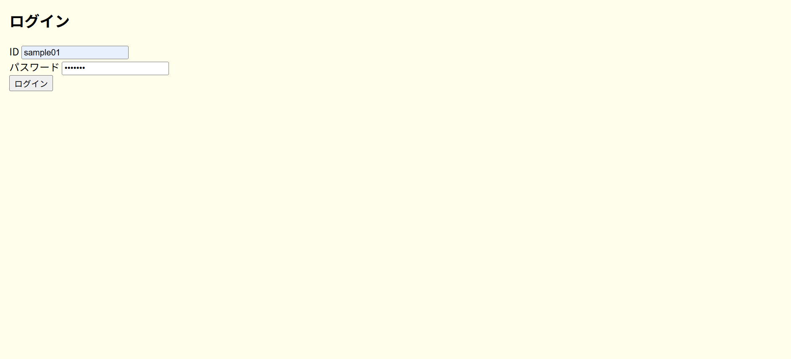
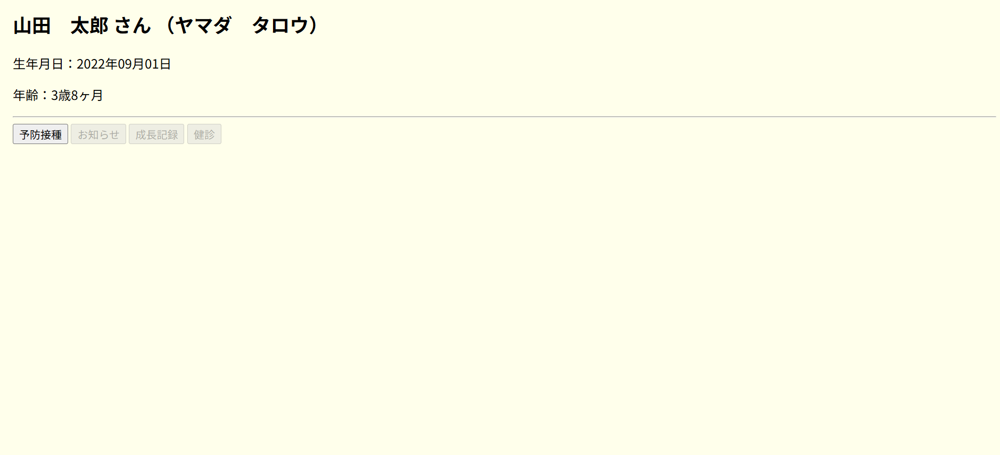
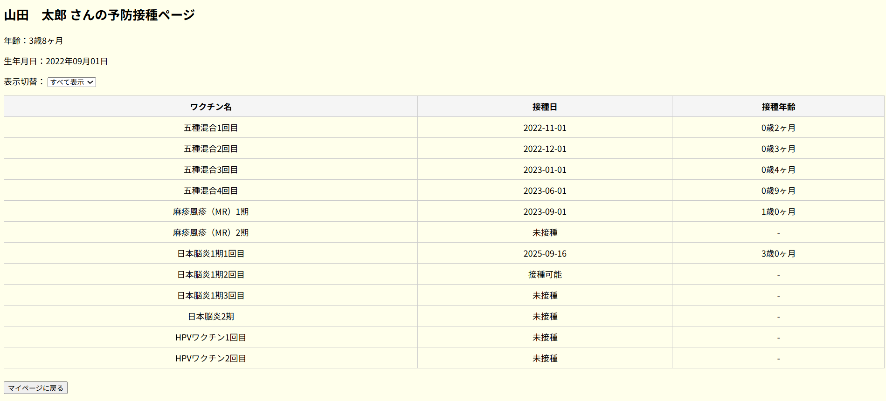
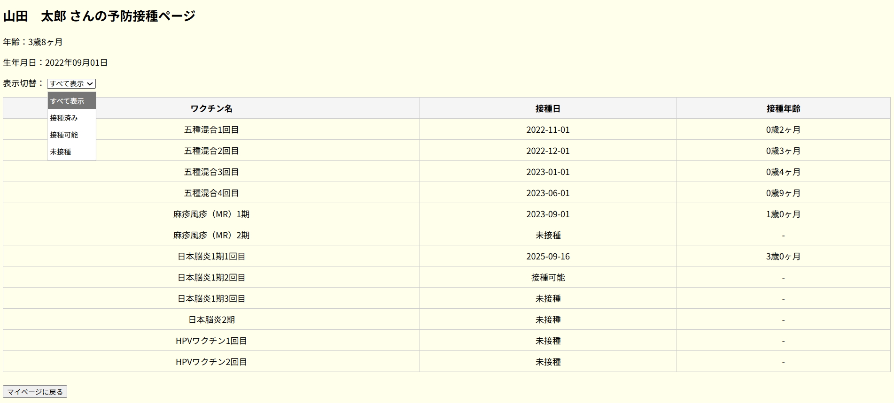
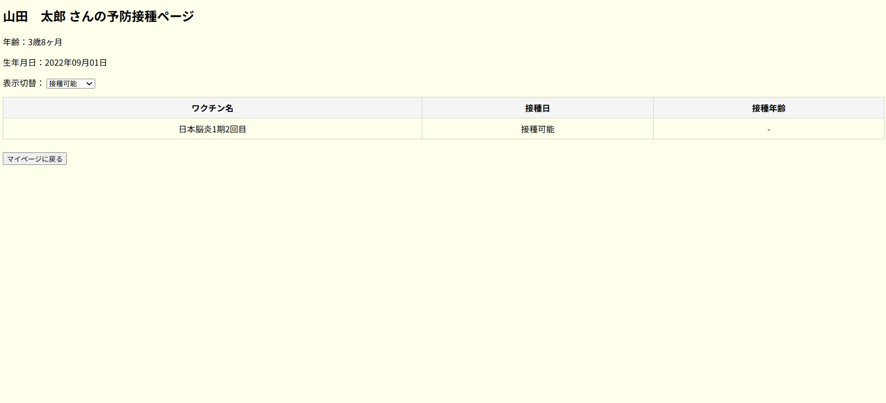

# 子どもの予防接種を、家庭と医療機関で一緒に見守るアプリ
私は以前、保健所で予防接種担当として働いていました。
当時はまだマイナンバーアプリに予防接種履歴の閲覧機能がなく、
市として独自のオンラインサービスも提供していませんでした。
そのため、保護者も医療機関も 紙の母子手帳だけが唯一の情報源 でした。
もし母子手帳を紛失してしまうと、
市役所まで来てもらい、私たちがデータを検索して
紙に印刷して渡すという、とても回りくどい対応が必要でした。
医療機関側も、履歴が確認できなければ
接種間違いを避けるためにワクチンを打てないという状況があり、
現場では「早くデジタル化されればいいのに」とよく話していました。
この経験から、
「当時こんなサービスがあればよかったのに」 
という思いを形にしたのが、この Web アプリです。
本来は国・自治体・医療機関・家庭の4層で管理されるべき情報ですが、
ポートフォリオとしてわかりやすくするために、
今回は 医療機関（clinic_app） と 保護者（child_health_app） の
2つのアプリに絞って構築しました。
________________________________________
# プロジェクト概要
このアプリは、
子どもの予防接種情報を、医療機関と保護者の双方がオンラインで確認できる 
Web アプリケーションです。
•	医療機関側（clinic_app）
　→ 接種履歴の登録・削除・閲覧
•	保護者側（child_health_app）
　→ 接種状況の閲覧、月齢に応じた接種可能判定
予防接種のスケジュールは月齢に応じて自動判定され、
「接種済み」「接種可能」「未接種」 の3つに分類して表示します。
________________________________________
# アプリ構成
本プロジェクトは、医療機関側と保護者側の
2つの Flask アプリケーションで構成されています。
vaccination_app/
├── child_health_app/
│   ├── templates/
│   ├── app.py
│   ├── vaccine_status.py
│   ├── requirements.txt
│   └── .env（GitHub には含めない）
│
└── clinic_app/
    ├── templates/
    ├── app.py
    ├── cal_age.py
    ├── child_info.py
    ├── clinic_info.py
    ├── conn_db.py
    ├── vaccination_data.py
    ├── requirements.txt
    └── .env（GitHub には含めない）
________________________________________
# 主な機能
■ clinic_app（医療機関側）
•	対象者検索（ID）
•	接種履歴の閲覧
•	接種日の登録
•	接種日の削除（モーダル確認あり）
•	医療判断を尊重するため、接種可能判定は表示しない
医療機関側では、体調・既往歴などにより
接種の可否は医師が判断する必要があるため、
システム上で「接種可能／不可」を表示しない設計にしています。
________________________________________
■ child_health_app（保護者側）
•	ログイン
•	マイページ表示
•	接種履歴の閲覧
•	月齢に応じた接種スケジュールの自動判定
•	「接種済み／接種可能／未接種」のフィルタ表示
保護者向けには、
「今の月齢ならそろそろ受けられる時期ですよ」
という スケジュール上の目安 を表示しています。
________________________________________
# 画面構成

## 医療機関側（clinic_app）

### 医療機関ログイン画面
医療機関スタッフがログインIDとパスワードを入力して、予防接種情報管理画面へアクセスします。

### 対象者検索画面
医療機関スタッフが、対象者の氏名（フリガナ）とIDを入力して予防接種情報を検索します。

### 予防接種情報一覧画面
検索した対象者の接種履歴を一覧表示します。  
ワクチン名・接種日・接種年齢が表形式で確認でき、編集や削除操作も可能です。

### 接種日編集画面
対象者の接種履歴を編集する際、カレンダーから日付を選択できます。  
選択した日付は即時に画面へ反映され、データベースにも更新されます。

### 削除確認ポップアップ
対象の接種情報を削除する際、確認ダイアログが表示されます。  
「OK」を押すと該当データが削除され、画面およびデータベースに反映されます。

## 家庭側（child_health_app）

### 家庭側ログイン画面
家庭の利用者がログインIDとパスワードを入力して、予防接種情報を閲覧・管理します。

### 家庭側トップ画面
ログイン後、子どもの基本情報（氏名・生年月日・年齢）が表示されます。  
「予防接種」「お知らせ」「成長記録」「健診」などのボタンから各機能へアクセスできます。

### 予防接種情報ページ
家庭側の利用者が、子どもの接種履歴を一覧で確認できる画面です。  
ワクチン名・接種日・接種年齢が表形式で表示され、未接種や接種可能な項目も一目で把握できます。

### 予防接種情報ページ（表示切替機能付き）
家庭側の利用者は、接種状況に応じて「すべて表示」「接種済み」「接種可能」「未接種」を切り替えて閲覧できます。  
ワクチン名・接種日・接種年齢が表形式で整理され、進捗状況を簡単に確認できます。

### 予防接種情報ページ（接種可能フィルター適用）
「接種可能」を選択すると、現在接種対象となっているワクチンのみが表示されます。  
家庭側の利用者は、次に受けるべきワクチンを簡単に確認できます。

________________________________________
# 使用技術
■ バックエンド
•	Python 3.x
•	Flask
•	MariaDB / MySQL
•	python-dotenv
•	Werkzeug（Flask 内部）
■ フロントエンド
•	HTML / CSS
•	JavaScript（バニラ）
　- モーダル表示
　- ラジオボタンによるフィルタ切り替え
　- 削除フォームの動的生成
■ その他
•	Git / GitHub
•	.env による秘密情報管理
•	requirements.txt による依存管理
________________________________________
# データベース設計
（ここに ER 図を貼る）
本アプリでは、子どもの基本情報・接種履歴・ワクチン種類・接種スケジュール・医療機関情報を
5つのテーブルで管理しています。
各テーブルは以下のように関連しています。
※ 本アプリでは、ログインIDはユーザーが入力するため文字列（VARCHAR）で管理しています。
※ ワクチン種別や接種履歴などの内部データは、管理しやすいよう INT 主キーで運用しています。
________________________________________
1. users（子ども情報）
カラム名	型	説明
id	VARCHAR	ログインID（例：sample01）※主キー
name	VARCHAR	氏名
furigana	VARCHAR	フリガナ
birth_date	DATE	生年月日
gender	VARCHAR	性別
役割： 
保護者側・医療機関側の両方で参照される中心テーブル。
各子どもの基本情報を管理します。
________________________________________
2. vaccine_record（接種履歴）
カラム名	型	説明
id	INT	主キー
user_id	INT	users.id への外部キー
vac_type_id	INT	vaccine_type.id への外部キー
date_given	DATE	接種日
役割： 
医療機関側で登録・削除され、保護者側で閲覧される接種履歴。
「誰が」「どのワクチンを」「いつ打ったか」を記録します。
________________________________________
3. vaccine_type（ワクチン種類）
カラム名	型	説明
id	INT	主キー
vaccine_name	VARCHAR	ワクチン名
vac_type_code	VARCHAR	ワクチンコード（分類用）
役割： 
ワクチンの種類を管理します。
接種履歴（vaccine_record）やスケジュール（vaccine_schedule）と紐づきます。
________________________________________
4. vaccine_schedule（接種スケジュール）
カラム名	型	説明
id	INT	主キー
vac_type_id	INT	vaccine_type.id への外部キー
min_age_months	INT	接種推奨開始月齢
max_age_months	INT	接種推奨終了月齢
note	TEXT	備考（補足情報など）
役割： 
ワクチンごとの推奨接種時期（目安）を管理します。
保護者側画面で「接種可能（スケジュール上の目安）」を表示する際に利用します。
________________________________________
5. clinics（医療機関情報）
カラム名	型	説明
id	VARCHAR	医療機関ログインID（例：clinic01）※主キー
name	VARCHAR	医療機関名 
password	VARCHAR	ログイン用パスワード（ハッシュ化）
役割： 
医療機関側アプリのログイン認証に使用。
他テーブルとは直接紐づけず、認証専用として独立させています。
________________________________________
テーブル間の関係（ER 図イメージ）
users (1) ──── (多) vaccine_record ──── (多) vaccine_type ──── (1) vaccine_schedule
clinics（独立）
•	1人の子どもに対して複数の接種履歴が紐づく
•	ワクチン種類とスケジュールは 1対1
•	医療機関情報は認証専用で他テーブルと独立
________________________________________
設計上のポイント
•	接種履歴を中心に構成し、データの整合性を保つ
•	外部キーでリレーションを明確化
•	医療機関情報は認証専用テーブルとして分離
•	実務経験に基づき、
医療側では接種可能判定を表示せず、
保護者側のみスケジュール上の目安を表示
•	vaccine_status.py で月齢判定ロジックを実装し、
保護者側画面に「接種可能」アラートを表示

________________________________________
# セットアップ方法
本アプリは、
医療機関側（clinic_app） と 保護者側（child_health_app） の
2つの Flask アプリケーションで構成されています。
________________________________________
1. リポジトリのクローン
git clone https://github.com/あなたのアカウント/vaccination-portfolio.git
cd vaccination-portfolio/vaccination_app
________________________________________
2. 仮想環境の作成（任意）
python -m venv venv
source venv/bin/activate   # macOS / Linux
venv\Scripts\activate      # Windows
________________________________________
3. 依存パッケージのインストール
clinic_app と child_health_app それぞれで実行：
pip install -r requirements.txt
________________________________________
4. データベースの準備
CREATE DATABASE my_app_db;
テーブル構造は README の「データベース設計」を参照。
________________________________________
5. .env の設定
clinic_app の .env（サンプル）
DB_HOST=127.0.0.1
DB_PORT=3306
DB_USER=root
DB_PASSWORD=your_password
DB_NAME=my_app_db

SECRET_KEY=clinic_secret_key

child_health_app の .env（サンプル）
DB_HOST=127.0.0.1
DB_PORT=3306
DB_USER=root
DB_PASSWORD=your_password
DB_NAME=my_app_db

CHILD_APP_SECRET_KEY=your_secret_key
※ 注意事項
•	.env は GitHub にアップロードしないでください
•	SECRET_KEY / CHILD_APP_SECRET_KEY は Flask のセッション管理に使用
•	your_password / your_secret_key は各自の環境に合わせて設定
________________________________________
6. アプリの起動
医療機関側（clinic_app）
cd clinic_app
python app.py
保護者側（child_health_app）
cd child_health_app
python app.py
________________________________________
# 今後の拡張（母子手帳アプリとしての発展）
本アプリは、もともと 「母子手帳アプリ」 を目指して設計しており、
現在実装している予防接種管理機能は、その 第一フェーズ にあたります。
今後は、母子手帳アプリとしての利便性を高めるため、
以下の機能を段階的に追加していく構想があります。
________________________________________
1. 成長記録（身長・体重）の登録・グラフ表示
•	月齢ごとの身長・体重を記録
•	標準曲線との比較グラフを表示
•	成長の推移を視覚的に確認できるようにする
________________________________________
2. 乳幼児健診の記録管理
•	3〜4ヶ月健診、1歳半健診、3歳健診などの記録
•	医師のコメントや測定値を保存
•	健診スケジュールのリマインド表示
________________________________________
3. 妊娠期の記録（母体側の機能）
•	妊娠週数の自動計算
•	妊婦健診の記録
•	体重・血圧・体調メモの管理
•	出産予定日カウントダウン
________________________________________
4. アレルギー・既往歴の管理
•	食物アレルギー
•	薬剤アレルギー
•	既往症
•	緊急時に医療機関へ提示できる画面の作成
________________________________________
5. 成長日記（写真・メモ）の保存
•	写真付きの成長記録
•	月ごとのアルバム生成
•	“母子手帳の思い出ページ”をデジタル化
________________________________________
6. カレンダー連携
•	予防接種
•	健診
•	妊婦健診
•	イベント
などをカレンダーに自動登録し、
家庭のスケジュール管理をサポート。
________________________________________
7. 医療機関との連携強化
•	接種予約機能
•	予約リマインド通知
•	医療機関からのお知らせ配信
________________________________________
8. 母子手帳の主要ページのデジタル化
•	紙の母子手帳にある項目を UI として再現
•	必要な情報を一つのアプリで完結できるようにする
________________________________________
